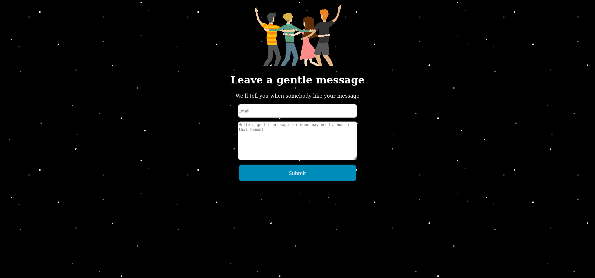
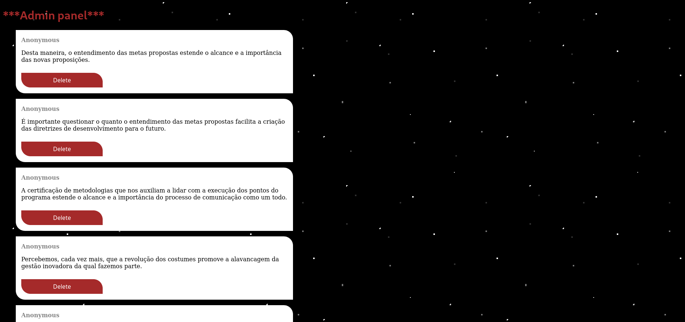
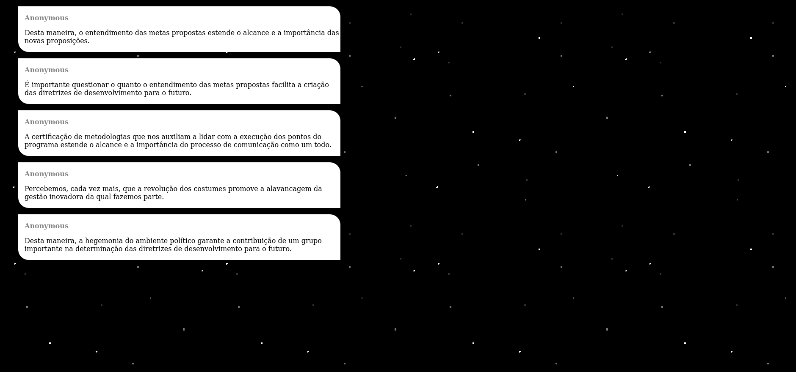

# SAY - something gentle for whom may be in need 

  ## Description 
  I made this to test some NodeJS skills i was studying. In this project i basically used NodeJS, Handlebars, ExpressJS and Sequelize(MySQL).
  The website basically shows a page with some nice messages(written by whoever), you can write a message too going to `/form`. The messages will be stored in a       MySQL database. If you don't want to use phpMyAdmin you can go to `/admin` and delete the messages by there.
  
  ## Installation 
  The user should clone the repository from GitHub and download Node. Others libs you'll may need: Sequelize, Handlebars, ExpressJS and Body-Parser.
  Just clone the repository, install the libs i said, do a `cd src/` and run `node app.js`.

  ## Screenshots
  
  
  

  ## Contact me
  If you want to know more about me or the projects i'm working on you can contact me on allyson2308h@gmail.com. You can view more of my projects at                   https://github.com/all123all.
